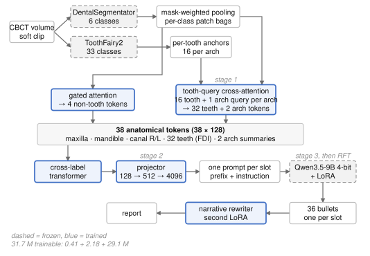

# SINUS — SigLIP-Initialised Narrative via Utterance Selection

Reference implementation of our submission to **Task 1 of the ODIN 2026 ToothFairy4
challenge**: generating a free-text maxillofacial radiology report from a single dental
cone-beam CT volume.

Instead of handing the volume to a vision–language model end to end, SINUS factors the
task along anatomy. Two frozen segmentation networks localise the structures; a small
learned aggregator turns their features into **38 anatomical tokens** (32 teeth in FDI
notation, two arch summaries, maxilla, mandible, and the right and left mandibular
canal); each token is projected into the embedding space of a frozen 4-bit 9B language model
and **decoded separately**, so a normal or out-of-field structure is trained to emit an
immediate end-of-sequence token. The language model is then refined by
rejection-sampling fine-tuning against a per-region entailment reward, and a separately
trained LoRA adapter rewrites the 36 structure-wise bullets into one narrative report.

Only **31.7M parameters** are ever updated: a 0.41M aggregator, a 2.18M projector and a
29.1M LoRA adapter. Both segmentation networks and the language model's own weights stay
frozen, and inference fits in 24GB.

## Architecture



Dashed boxes are frozen, blue boxes are trained. Both segmentation networks and the
language model's own weights stay frozen; 31.7M parameters are updated in total.

Each slot is decoded as its own sequence — system prompt, visual prefix, slot-specific
instruction — and the loss is taken on that slot's target only. All 38 slots are fed for
every patient regardless of the reference, so nothing about which structures are
abnormal leaks into the input and training matches inference exactly. Normal and
out-of-field slots carry an empty target, which is how silence becomes an explicit
learned behaviour; since 32 of 38 slots are typically empty, finding-bearing slots get
1.6x the token loss and checkpoints are selected on finding-slot loss.

Training runs as a curriculum in which every stage optimises one objective and starts
from the previous stage's checkpoint:

| stage | output dir | trains | objective |
|---|---|---|---|
| 1 | `models/sinus_perception` | aggregator + findings head (0.41M) | categorical claim loss + 0.5 · region–text SigLIP |
| 2 | `models/sinus_prefix` | projector (2.18M) | per-slot token cross-entropy |
| 3 | `models/sinus_llm_lora` | LoRA (29.1M) | per-slot token cross-entropy |
| RFT | `models/sinus_rft` | LoRA (29.1M) | selected rollouts, one epoch |

From stage 2 on there is no findings head, so claim information reaches the language
model only through the anatomical tokens. A variant that trained the aggregator and the
projector jointly between stages 2 and 3 made no difference and is not part of this
pipeline.

## Layout

```
src/toothfairy/          the model package
  config.py              one dataclass tree for every knob; configs/*.yaml fill it in
  paths.py               the repository root, resolved in one place
  schema/claims.py       the claim vocabulary: 10 per-tooth axes + region axes
  perception/            frozen backbones, mask-weighted pooling, normalisation, caching
  encoder/               gated attention, tooth-query cross-attention, cross-label encoder
  heads/findings.py      linear claim heads on the anatomical tokens (stage 1 only)
  losses/                claim loss (effective-number class weights) and the SigLIP term
  models/report_model.py the assembled model: encoder → prefix → per-slot decode + losses
  generation/            visual prefix, chat assembly, per-slot decoding, post-processing
  data/                  datasets, collates, split generation
  training/              the stage-1 and stage-2/3 trainers, DDP wiring
  rl/                    rollouts, rewards, the entailment judge, claim extraction
  pipeline/              the reproduction programs (caching, generation, RFT, rewriting, scoring)
  inference.py           one volume → one report, with no cache and no ground truth
  configs/               the configs that define the submitted model
  cli/                   the six entry points below
```

| entry point | what it runs |
|---|---|
| `python -m toothfairy.cli.cache` | build the two feature caches |
| `python -m toothfairy.cli.train` | the three-stage curriculum |
| `python -m toothfairy.cli.rft` | rejection-sampling fine-tuning |
| `python -m toothfairy.cli.rewrite` | the narrative rewriter (train / apply) |
| `python -m toothfairy.cli.eval` | generate → captioning → official score |
| `python -m toothfairy.cli.report` | single-volume inference |

Every entry point takes `--help`, and every program under `pipeline/` can also be run on its
own with `python -m toothfairy.pipeline.<name>` when only one step has to be repeated.

## Installation

```bash
pip install torch==2.11.0 --index-url https://download.pytorch.org/whl/cu128
pip install -r requirements.txt
pip install -e .
```

Python 3.11 and a CUDA-capable GPU. Training was done on an H100 80GB; inference fits in
24GB. Both frozen segmentation networks have to be installed as nnU-Net model folders.

torch comes from its own index, so it is installed first and separately; that is why
`pyproject.toml` pins no runtime dependencies of its own. Without `pip install -e .` the
commands still work from the repository root with `PYTHONPATH=src`.

⚠️ Run from a checkout even when the package is installed: the data, the feature caches and
the model directories are resolved relative to the repository root, not to the installation
(`src/toothfairy/paths.py`).

## Reproducing

- **[DATA.md](DATA.md)** — what has to be on disk, and in what format
- **[TRAIN.md](TRAIN.md)** — splits, caches, the curriculum, RFT, the rewriter
- **[EVAL.md](EVAL.md)** — generation, captioning, the clinical metric, the official score

In short:

```bash
python -m toothfairy.data.make_splits                    # patient-level split, seed 42
python -m toothfairy.cli.cache                          # both feature caches (hours; resumable)
python -m toothfairy.cli.train --gpus 0                 # perception → prefix → LLM LoRA
python -m toothfairy.cli.rft rollout --help             # then follow TRAIN.md §4
python -m toothfairy.cli.eval generate --run-dir models/sinus_rft_eval
```

## Single-volume inference

`toothfairy.cli.report` is the whole path from a raw volume to a report: preprocessing, both
segmentation networks, the aggregator, 38 decodes and the narrative rewrite. Peak VRAM is
19.8GB and one case takes about 170s.

```bash
python -m toothfairy.cli.report --model-dir /path/to/weights --volume case.nii.gz
```

The weights are not in this repository (about 7.6GB, including the frozen language model).
The model directory is expected to look like this:

```
<model-dir>/
  best.pt                  the trained checkpoint (aggregator + projector + LoRA)
  config.resolved.yaml     the exact resolved config that produced it
  dental_segmentator/      nnU-Net model folder, fold 0, checkpoint_final.pth
  tf2_segmentator/         nnU-Net model folder, fold 5, checkpoint_final.pth
  llm/                     the frozen language model (config.realizer.llm_name points here)
  rewrite_adapter/         the narrative rewriter, with train_meta.json alongside it
```

The 38 slot outputs become one report through the rewrite adapter.
`train_meta.json` must travel with the adapter: it records whether the rewriter was
trained without the two arch-summary slots, so that 36 or 38 slots are fed accordingly, and it
carries the training prompt, which is compared against the one about to be used.

## Not included

- **Data and training targets.** The ToothFairy4 volumes and reports are distributed by the
  challenge organisers under their own licence, and the structure-wise training targets fall
  under the same terms. Medical imaging data cannot be republished here, so what this
  repository releases is the training and evaluation pipeline we used, not the material it was
  run on. [DATA.md](DATA.md) specifies the formats the training code reads, so the pipeline
  can be run against equivalent annotations.
- **Weights.** Neither ours nor the frozen third-party networks.
- **The evaluation container.** The submitted Grand Challenge algorithm was a thin I/O
  wrapper around `toothfairy.cli.report`; only the report-generation path is released.

## Licence

Apache License 2.0 — see `LICENSE`. It covers the code in this repository only; the
frozen networks, the language models and the challenge data each carry their own terms.
See `NOTICE`.
